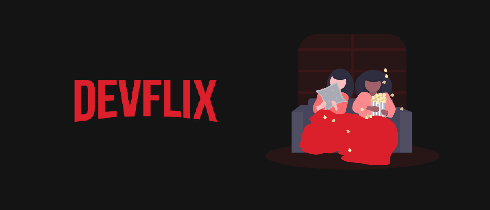

<div align="center">
    
</div>

<div align="center">
    <a href="https://github.com/Gustavo-Henrique-br" >
        
    </a>
    <a href="https://github.com/Gustavo-Henrique-br/Devflix/stargazers"></a>
</div>

<div align="center">
    <a href="https://github.com/Gustavo-Henrique-br/SpeedAudio/blob/master/README.md">
        
    </a>
</div>

<div align="center">
    <h1>🎥 Devflix 🎥</h1>
    <p>Um clone da 
      <a href="https://www.netflix.com/"><b>Netflix</b></a> usando <a href="https://angular.io/"><b>Angular</b></a> e <a href="https://www.themoviedb.org/"><b>The Movie Database</b></a>
    </p>
</div>

<hr>

<div align="center">
    <h2>🚧 Devflix 0.1 🚀 em construção... 🚧</h2>
</div>

Tabela de conteudos
=================
<!--ts-->
   * [Rodando](#rodando)
   * Como usar
      * [Pré-requisitos](#pre-requisitos)
      * [Instalando](#install)
   * [Techs](#techs)
<!--te-->

<div id="rodando" align="center">
    <h1>🎲 Rodando</h1>
</div>

<div id="pre-requisitos" align="center">
    <h4>Pré-requisitos</h4>
</div>

> Antes de começar, você precisa ter instalado na sua máquina o
[Git](https://git-scm.com), [Node.js (npm)](https://nodejs.org/en/).
Além disso, é bom ter um editor para trabalhar no código, como o [VSCode](https://code.visualstudio.com/).

<div id="install" align="center">
    <h4>
        Siga esses passos para instalar:
    </h4>
</div>

```bash
# clone o repositório na sua máquina
$ git clone https://github.com/Gustavo-Henrique-br/Devflix.git

# Instale as dependências:
$ yarn
# ou
$ npm install

# Rodando em watch mode
$ yarn start
# ou
$ npm run start

# Apenas buildando
$ yarn build
# ou
$ npm run build
```

<div id="techs" align="center">
    <h1>🛠 Tecnologias</h1>
</div>

- [Angular](https://angular.io/)
- [ngu-carousel](https://github.com/uiuniversal/ngu-carousel)
- [TMDB API](https://www.themoviedb.org/)