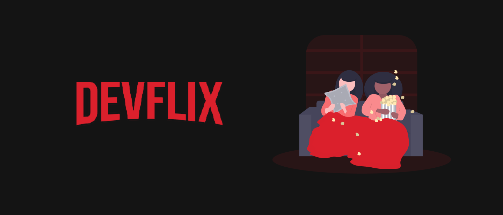

<div align="center">
    
</div>

<div align="center">
    <a href="https://github.com/Gustavo-Henrique-br" >
        
    </a>
    <a href="https://github.com/Gustavo-Henrique-br/Devflix/stargazers"></a>
</div>

<div align="center">
    <a href="https://github.com/Gustavo-Henrique-br/Devflix/blob/master/LEIAME.md">
        
    </a>
</div>

<div align="center">
    <h1>🎥 Devflix 🎥</h1>
    <p>A clone of
      <a href="https://www.netflix.com/"><b>Netflix</b></a> using <a href="https://angular.io/"><b>Angular</b></a> and <a href="https://www.themoviedb.org/"><b>The Movie Database</b></a>
    </p>
</div>

<hr>

<div align="center">
    <h2>🚧 Devflix 0.1 🚀 under construction... 🚧</h2>
</div>

Table of contents
=================
<!--ts-->
   * [Running](#rodando)
   * How to use
      * [Prerequisites](#pre-requisitos)
      * [Installing](#install)
   * [Techs](#techs)
<!--te-->

<div id="rodando" align="center">
    <h1>🎲 Running</h1>
</div>

<div id="pre-requisitos" align="center">
    <h4>Prerequisites</h4>
</div>

> Before start, you need have installed in your machine:
[Git](https://git-scm.com), [Node.js (npm)](https://nodejs.org/en/).
> In addition, it is good to have an editor to work on the code, such as [VSCode](https://code.visualstudio.com/).

<div id="install" align="center">
    <h4>
        follow those steps to install:
    </h4>
</div>

```bash
# clone the repository in your machine
$ git clone https://github.com/Gustavo-Henrique-br/Devflix.git

# Install the dependencies:
$ yarn
# or
$ npm install

# Running webpack in watch mode
$ yarn start
# or
$ npm run start

# Just building
$ yarn build
# or
$ npm run build
```

<div id="techs" align="center">
    <h1>🛠 Technologies</h1>
</div>

- [Angular](https://angular.io/)
- [ngu-carousel](https://github.com/uiuniversal/ngu-carousel)
- [TMDB API](https://www.themoviedb.org/)
